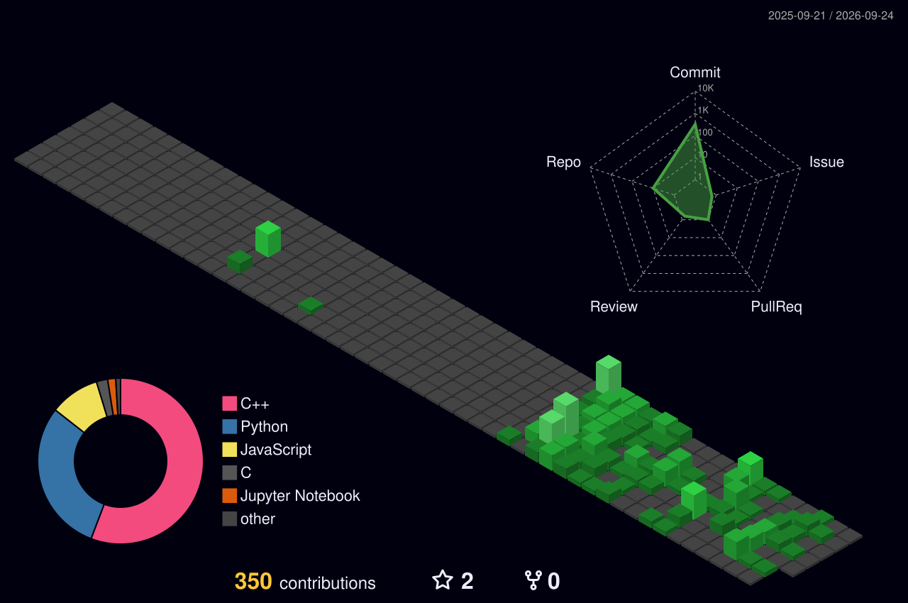

<div align="center">
  
</div>


<div align="center">


</div>

---

<div align="center">


</div>

---

## 🧑‍💻 About Me

```yaml
name      : Ashish Kumar Pandit
alias     : AshishKumar161
degree    : B.Tech — Artificial Intelligence
interests : [Cybersecurity, DSA, AI/ML, Web Development, Open Source]
location  : India 🇮🇳
status    : Actively Learning & Building
mantra    : "Code every day. Push every day. Never stop."
```

---

## ⚡ Current Focus

<table>
  <tr>
    <td>🛡️ <b>Cybersecurity</b></td>
    <td>Ethical hacking, threat detection, and security fundamentals</td>
  </tr>
  <tr>
    <td>💻 <b>DSA &amp; C++</b></td>
    <td>Solving problems daily — arrays, trees, graphs, dynamic programming</td>
  </tr>
  <tr>
    <td>🧠 <b>LeetCode Grind</b></td>
    <td>Consistent daily problem solving for placement prep</td>
  </tr>
  <tr>
    <td>🐍 <b>Python &amp; AI/ML</b></td>
    <td>Exploring ML models, RNNs, and data science tooling</td>
  </tr>
  <tr>
    <td>🌐 <b>Full Stack Web</b></td>
    <td>Building real-world apps with Node.js, HTML/CSS/JS</td>
  </tr>
  <tr>
    <td>📌 <b>GitHub Consistency</b></td>
    <td>Daily commits — building a green contribution graph</td>
  </tr>
</table>

---

## 🛠️ Tech Stack &amp; Tools

<div align="center">

**Languages**


**Frameworks &amp; Tools**


**Learning Next**


</div>

---

## 🏆 GitHub Trophies

<div align="center">


</div>

---

## 📌 Featured Repositories

<div align="center">

| Project | Description | Tech |
| --- | --- | --- |
| 🛡️ [Cyber-Threat-Report-Generator](https://github.com/AshishKumar161/Cyber-Threat-Report-Generator) | Generative AI threat detection system with HTML/CSS/JS GUI | `AI` `JS` `HTML` |
| 📚 [DSA-Daily-Practice](https://github.com/AshishKumar161/DSA-Daily-Practice) | Daily Data Structures and Algorithms practice | `C++` |
| 🧩 [C-Logic-Building-Exercises](https://github.com/AshishKumar161/C-Logic-Building-Exercises) | 200 C++ OOP challenges — linked lists, stacks &amp; queues | `C++` `OOP` |
| 🐍 [Python-Mastery-Core](https://github.com/AshishKumar161/Python-Mastery-Core) | Python fundamentals, Machine Learning &amp; RNNs practice | `Python` `ML` |
| 🌐 [Full-Stack-Development-Journey](https://github.com/AshishKumar161/Full-Stack-Development-Journey) | Web development learning journey | `Node` `JS` `CSS` |
| ⚡ [LeetCode-Solutions](https://github.com/AshishKumar161/LeetCode-Solutions) | Daily LeetCode solutions &amp; Discrete Math logic | `C++` `Python` |

</div>

---

## 📊 GitHub Stats

<div align="center">


</div>

---

## 🔥 GitHub Streak

<div align="center">


</div>

---

## 📈 Contribution Activity

<div align="center">


</div>

---

## 🌐 3D Contribution Globe

<div align="center">

<a href="https://github.com/AshishKumar161">

</a>

</div>

---

## 🎮 Cyber Snake — Live Contribution Animator

> 🐍 A custom-built Python engine renders every contribution block as food for the snake.  
> The snake **levels up and transforms** as it eats — changing colour, glow, and head shape through **5 distinct phases**, all driven by real GitHub data, regenerated daily via GitHub Actions.

<div align="center">


</div>

<div align="center">

| Phase | Trigger | Skin | Head Style |
|:-----:|:-------:|------|:----------:|
| 1 | Start | 🟢 **Cyber Green** | Diamond |
| 2 | 20% eaten | 🔵 **Electric Blue** | Arrow |
| 3 | 40% eaten | 🟣 **Plasma Purple** | Cobra Hood |
| 4 | 60% eaten | 🟠 **Fire Orange** | Dragon + Horns |
| 5 | 80% eaten | 🟡 **Golden Elite** | Crown + Gem |

</div>

---

## 🤖 Automation — GitHub Actions

Two workflows keep the profile auto-updated every day at midnight UTC:

| Workflow | Schedule | What it does |
|----------|----------|--------------|
| 🐍 **Snake Animator** | Daily + every push | Fetches live contribution data → renders multi-phase snake GIF → pushes to `output` branch |
| 🌐 **3D Contribution Globe** | Daily | Generates `profile-3d-contrib/profile-night-green.svg` |

---

## 🎯 2026 Goals

<div align="center">

```
╔══════════════════════════════════════════════════════╗
║              MISSION OBJECTIVES — 2026               ║
╠══════════════════════════════════════════════════════╣
║  [✔] Solve DSA problems daily                        ║
║  [✔] Push code on GitHub consistently                ║
║  [ ] Build cybersecurity projects & tools            ║
║  [ ] Learn AI/ML deeply — build real ML models       ║
║  [ ] Reach 200+ LeetCode problems solved             ║
║  [ ] Build a full-stack web application              ║
║  [ ] Land a tech internship or placement             ║
╚══════════════════════════════════════════════════════╝
```

</div>

---

## 💬 Dev Quote

<div align="center">


</div>

---

## 🤝 Connect With Me

<div align="center">

[](https://github.com/AshishKumar161)
[](https://linkedin.com/in/AshishKumar161)
[](https://leetcode.com/AshishKumar161)
[](mailto:ashishkumar161@example.com)

</div>

---


<div align="center">
  <sub>⚡ Built with passion by <b>Ashish Kumar Pandit</b> · Auto-updated daily by GitHub Actions</sub>
</div>
